Wattfeder is a learning and portfolio project for exploring reliable
distributed energy systems in Go.

It is not a production virtual power plant. The project focuses on
telemetry processing, device state, control decisions, failure handling,
observability, and deployment.

## Current status

Milestone v0.1 is in progress. The simulator currently produces one
deterministic 24-hour UTC timeline containing photovoltaic (PV) power,
household load, electricity price, and a battery state of charge that evolves
from interval energy flows within physical capacity bounds. Valid telemetry can
initialize and update the latest in-memory state for one household device. A
deterministic policy produces charge, discharge, or idle commands with
human-readable reasons from PV surplus, household load, battery SOC, and
electricity price. The runnable application pipeline is not wired yet.

## Architecture snapshot

```mermaid
flowchart LR
    CLI["cmd/wattfeder<br/>placeholder"]
    Simulator["Deterministic simulator"]
    Telemetry["Telemetry and validation"]
    State["Latest household state"]
    Policy["Control policy"]
    Command["Charge, discharge, or idle command"]
    Output["Structured output<br/>not implemented"]

    CLI -. "not wired" .-> Simulator
    Simulator -->|generates| Telemetry
    Telemetry -->|ApplyTelemetry| State
    State -->|Decide| Policy
    Policy -->|returns| Command
    Command -. "not wired" .-> Output

    class Simulator,Telemetry,State,Policy,Command implemented
    class CLI,Output pending
    classDef implemented stroke-width:2px
    classDef pending stroke-width:2px,stroke-dasharray:6 4
```



Run the automated checks with:

```bash
go test ./...
```

## Documentation

- [Roadmap](docs/roadmap.md) shows current progress and planned milestones.
- [Simulation model](docs/simulation-model.md) explains the energy units,
  generated profiles, guarantees, and deliberate simplifications.
