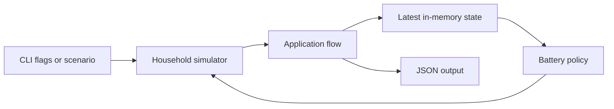

# Wattfeder

Wattfeder simulates one household with solar panels and a battery. It explores
how changing production, electricity use, and price affect simple battery
decisions. The current program runs locally and keeps all state in memory.
The fixed demo shows how telemetry becomes battery decisions. The documents
below explain setup, runtime flow, and model limits.

## What Wattfeder does

The simulator produces a fixed 24-hour household timeline. Each telemetry event
contains solar production, household load, battery state, and electricity price.
A control policy chooses whether to charge, discharge, or leave the battery idle.

## Current status

| Status | Scope |
| --- | --- |
| Implemented | One deterministic household simulation, telemetry validation, battery state updates, control decisions, JSON output, and graceful shutdown. |
| Partially implemented | Telemetry passes through the simulator, state, and policy code, but the latest state exists only in memory. |
| Planned | Persistent storage, failure simulation, multiple households, network inputs, and operational metrics. |

The [roadmap](docs/roadmap.md) separates completed work from planned milestones.

## Demo

```bash
make demo
```

This command loads a fixed scenario and runs four six-hour intervals. The output
shows each telemetry event, each battery decision, and a final result check. See
the [demo guide](docs/DEMO.md) for the scenario and expected output.

## Architecture snapshot



See [Architecture](docs/ARCHITECTURE.md) for component responsibilities and data
flow.

## Model assumptions

The profiles are synthetic. They are not forecasts for a real household. The
battery has perfect efficiency and no power limit. The grid supplies unmet load
and receives unused solar production.

See [Model assumptions](docs/MODEL.md) for units, rules, and limitations.

## Documentation

- [Development setup](docs/SETUP.md)
- [Demo](docs/DEMO.md)
- [Architecture](docs/ARCHITECTURE.md)
- [Model assumptions](docs/MODEL.md)
- [Roadmap](docs/roadmap.md)
