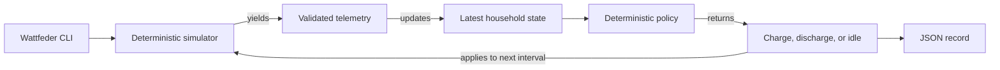

# Wattfeder

Wattfeder is a learning and portfolio project for exploring reliable
distributed energy systems in Go.

It is not a production virtual power plant. The project focuses on telemetry
processing, device state, control decisions, failure handling, observability,
and deployment through deliberately incremental milestones.

## Current status

Milestone v0.1 is complete. The runnable application simulates one deterministic
24-hour household timeline, validates each telemetry event, updates the latest
in-memory state, chooses a charge, discharge, or idle command, applies that
command to subsequent battery SOC, and emits one JSON record per interval.
SIGINT and SIGTERM stop the run gracefully.

State and output are process-local. Persistent telemetry, commands, and latest
device state are planned for v0.2.

## Architecture snapshot



## Requirements

- Go 1.26.5
- Make, if you want to use the convenience targets

## Setup and execution

Clone the repository and run the default one-hour interval simulation:

```bash
git clone https://github.com/Stewz00/wattfeder.git
cd wattfeder
go run ./cmd/wattfeder
```

The command emits 24 newline-delimited JSON records and then exits. `make run`
starts the same default simulation.

Use `-help` to list every configuration flag:

```bash
go run ./cmd/wattfeder -help
```

For example, this runs one interval covering the full simulated day:

```bash
go run ./cmd/wattfeder -interval 24h
```

Example output, formatted across lines for readability:

```json
{
  "timestamp": "2026-08-07T00:00:00Z",
  "device_id": "home-001",
  "pv_power_kw": 0,
  "load_power_kw": 0.3861461516439471,
  "battery_soc_percent": 50,
  "electricity_price_eur_kwh": 0.31498997331311535,
  "decision": "discharge",
  "command_power_kw": 0.3861461516439471,
  "reason": "Electricity price is at or above EUR 0.30/kWh and household load exceeds PV production"
}
```

Press Ctrl+C while a run is active to request graceful cancellation.

## Verification

Run formatting checks, module verification, static analysis, tests, and builds:

```bash
make check
```

## Model assumptions

- A simulated day is exactly 24 hours from the configured start and uses UTC.
- The sampling interval must divide 24 hours without a partial final event.
- The seed varies daily PV, load, and price levels reproducibly.
- Battery SOC is bounded between 0% and 100% with perfect efficiency and no
  battery power limit.
- The control policy charges a PV surplus unless the battery is full.
- It discharges a load deficit only above the 20% SOC reserve and at an
  electricity price of at least EUR 0.30/kWh.
- Idle decisions leave the battery unchanged; the grid implicitly handles the
  remaining household surplus or deficit.

See the [simulation model](docs/simulation-model.md) for units, profile shapes,
guarantees, and deliberate simplifications.

## Documentation

- [Roadmap](docs/roadmap.md) describes current progress and planned milestones.
- [Internal implementation checklist](docs/llm-checklist-roadmap.md) tracks
  verified execution state for development workflows.
