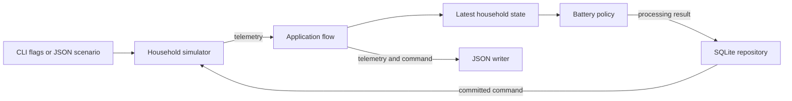

# Architecture

## System context

Wattfeder is one command-line application. It generates household telemetry and
chooses battery commands. It does not connect to an external energy device or
service.

## Components

| Component | Responsibility | Main input | Main output | Important dependency |
| --- | --- | --- | --- | --- |
| Command-line entry point | Parse flags or load a demo scenario. Start one run. | Process arguments | Simulator configuration | Go flag parser or demo loader |
| Demo loader | Parse fixed JSON values and expected decisions. | Scenario file | Validated demo scenario | Simulator configuration rules |
| Household simulator | Own the clock, generated profiles, and battery state. | Configuration and battery command | Telemetry event | Seeded random number generator |
| Application flow | Move each event through state, policy, command application, and output. | Simulator telemetry | Combined telemetry and decision record | Simulator and household packages |
| Latest household state | Validate telemetry and retain the latest accepted values. | Telemetry event | Current household values | Telemetry validation |
| Battery policy | Choose charge, discharge, or idle. | Current household values | Battery command and reason | Battery capacity and interval |
| SQLite repository | Migrate the schema and atomically persist each processing result. | Telemetry, state, and command | Stored or duplicate status | SQLite adapter |
| JSON writer | Write records to the terminal. | Telemetry and decisions | Newline-delimited JSON | Standard output |

## Data flow

1. The entry point builds a simulator configuration from flags or a scenario.
2. Normal CLI startup migrates SQLite and restores the latest battery SOC for
   the configured device when one exists.
3. The simulator emits telemetry for the current timestamp.
4. The application validates the event through the latest-state component.
5. The policy reads the state and returns one command.
6. The repository atomically commits the telemetry, latest state, and command.
7. The simulator applies the committed command over the interval.
8. The application writes the telemetry and decision.
9. The next event reports the updated battery state.

The default command writes one combined JSON record per interval. The demo
writes separate progress records so each step is visible.

## Storage

The SQLite adapter owns ordered schema migrations and atomically stores
telemetry history, command history, and latest device state. Event IDs link all
three durable records and let the adapter reject duplicate processing without
changing existing data. See the
[persistence design](engineering/PERSISTENCE-DESIGN.md) for the schema and
transaction semantics.

The normal CLI opens `wattfeder.db` by default, applies pending migrations, and
restores the latest state for its device before constructing the simulator. A
different path can be selected with `-database`. The fixed JSON demo stays
in-memory and creates no database.

## Configuration

The default application uses command-line flags. Run
`go run ./cmd/wattfeder -help` to list them. The default database path is
`wattfeder.db`. The demo reads `scenarios/demo.json`. Unknown scenario fields
and invalid values cause an error.

The simulator always runs for 24 hours. Its interval must divide that duration
exactly. The seed controls repeatable daily variation. No environment variables
are required.

## Failure handling

Configuration and telemetry are validated before use. Invalid telemetry does
not replace the latest state. Persistence failures and duplicate events stop
before the simulator applies a command. An invalid command does not advance the
simulator. Output failures stop the run and return an error.

The application checks cancellation before each interval. SIGINT and SIGTERM
cancel the command without reporting an execution failure.

## Current limitations

- One process handles one household.
- There is no queue, network API, or external telemetry source.
- The state component accepts one device ID per run.
- There are no retries because the current flow has no external operations.
- A crash after the database commit but before command application can leave
  durable state ahead of command delivery; recovery for that window is not yet
  defined.
- Health endpoints and runtime metrics are not implemented.
- Planned components are listed in the [roadmap](roadmap.md), not in the current
  architecture diagram.
