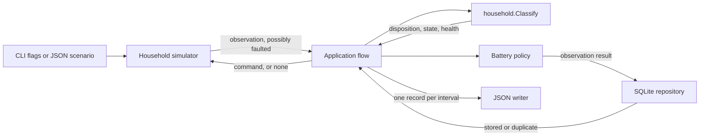

# Architecture

## System context

Wattfeder is one command-line application. It generates household telemetry and
chooses battery commands. It does not connect to an external energy device or
service.

## Components

| Component | Responsibility | Main input | Main output | Important dependency |
| --- | --- | --- | --- | --- |
| Command-line entry point | Parse flags or load a demo scenario. Start one run. | Process arguments | Simulator configuration | Go flag parser or demo loader |
| Demo loader | Parse fixed JSON values, an optional fault schedule, and expected results. | Scenario file | Validated demo scenario | Simulator configuration rules |
| Household simulator | Own the clock, generated profiles, battery state, and deterministic fault injection. | Configuration and an optional battery command | Observation envelope, or none for a missing heartbeat | Seeded random number generator |
| `household.Classify` | Turn one observation into a disposition, optional history/state update, command eligibility, and health. | Observation envelope, prior state, prior health | Classification result | None — pure domain function |
| Application flow | Restore a device snapshot, classify each observation, commit it, and decide whether to apply its command. | Simulator observations | One flat record per interval | Simulator, household, and persistence packages |
| Battery policy | Choose charge, discharge, or idle for an accepted, non-suppressed event. | Current household values | Battery command and reason | Battery capacity and interval |
| SQLite repository | Migrate the schema, restore device snapshots, and atomically persist each observation result and device health. | Observation result | Stored or duplicate status | SQLite adapter |
| JSON writer | Write records to the terminal. | Application records | Newline-delimited JSON | Standard output |

## Data flow

1. The entry point builds a simulator configuration from flags or a scenario.
2. Normal CLI startup migrates SQLite and restores the device snapshot
   (latest state, receive time, and health) for the configured device.
3. The simulator produces the next interval's observation envelope, applying
   any configured fault; a missing heartbeat yields no envelope at all.
4. `household.Classify` turns the observation, together with the prior state
   and health, into a disposition, an optional telemetry/state update,
   whether a command may be applied, and the resulting health.
5. If the disposition is accepted and not suppressed, the policy decides one
   command from the new state.
6. The repository atomically commits the observation result — telemetry,
   latest state, and command are each written only when present — and always
   writes device health, unless the event ID turns out to be a duplicate, in
   which case nothing changes.
7. The simulator completes the interval with the command, or with no command
   when one was suppressed or rejected; the battery is held idle in that case.
8. The application writes one record for the interval, whatever its
   disposition, and continues to the next interval regardless.

The default command writes one flat JSON record per interval. The demo
writes separate progress records so each step is visible. Neither one stops
early for a duplicate, historical, delayed, rejected, missing, or
unavailable observation — see
[ADR-008](engineering/adr/ADR-008-unreliable-telemetry-disposition-and-health.md)
for why.

## Storage

The SQLite adapter owns ordered schema migrations and atomically stores
telemetry history (with its disposition and reason), command history, latest
device state, and durable device health. Event IDs link the durable records
and let the adapter reject duplicate processing without changing existing
data, including health. See the
[persistence design](engineering/PERSISTENCE-DESIGN.md) for the schema and
transaction semantics, and [ADR-008](engineering/adr/ADR-008-unreliable-telemetry-disposition-and-health.md)
for the disposition and health rules it enforces.

The normal CLI opens `wattfeder.db` by default, applies pending migrations, and
restores the device snapshot for its device before constructing the simulator.
A different path can be selected with `-database`. The demo always runs
against a file-free in-memory SQLite database, so it exercises the same
durable path as the CLI without creating a file on disk.

## Configuration

The default application uses command-line flags. Run
`go run ./cmd/wattfeder -help` to list them. The default database path is
`wattfeder.db`. The demo reads `scenarios/demo.json`. Unknown scenario fields
and invalid values cause an error.

The simulator always runs for 24 hours. Its interval must divide that duration
exactly. The seed controls repeatable daily variation. No environment variables
are required.

## Failure handling

Configuration is validated before use. Every observation is classified before
it can affect state: invalid, missing, unavailable, historical, and duplicate
observations never replace the latest state or produce a command, but they do
not stop the run either — the application continues to the next interval and
reports each one with its disposition and reason. Only context cancellation,
a simulator error, a genuine persistence error (not a duplicate result), or an
output failure stop a run early. An invalid command does not advance the
simulator.

The application checks cancellation before each interval. SIGINT and SIGTERM
cancel the run without reporting an execution failure.

## Current limitations

- One process handles one household.
- There is no queue, network API, or external telemetry source.
- The application accepts one device ID per run.
- There are no retries because the current flow has no external operations; a
  suppressed or rejected command is skipped for that interval, not queued.
- A crash after the database commit but before command application can leave
  durable state ahead of command delivery; recovery for that window is not yet
  defined.
- Health endpoints and runtime metrics are not implemented; device health is
  durable but only observable through persisted records and application
  output, not a live query interface.
- Planned components are listed in the [roadmap](roadmap.md), not in the current
  architecture diagram.
