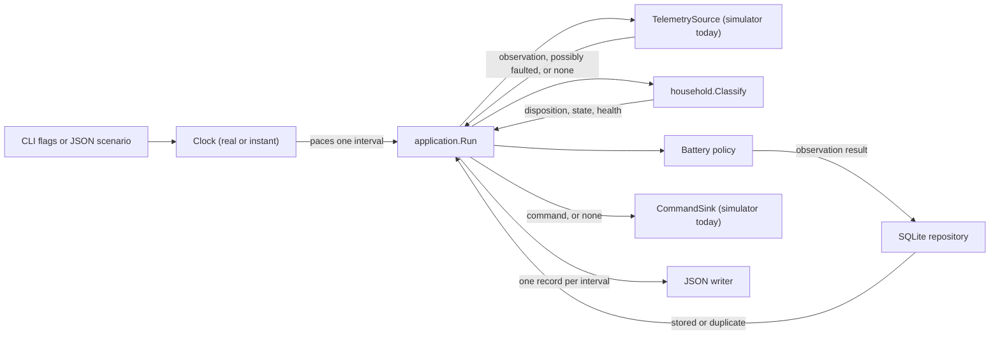

# Architecture

## System context

Wattfeder is one command-line application. It generates household telemetry and
chooses battery commands. It does not connect to an external energy device or
service.

The application runs one household continuously. It ends only when the context
is cancelled (SIGINT or SIGTERM), the telemetry source reports it has nothing
more to give, or a configured interval count is reached — never on a fixed
day boundary. `TelemetrySource` and `CommandSink` are the only points where the
runtime touches telemetry and control; the household simulator is the only
adapter that implements them today, and a different source can replace it
without changing `internal/application` or `internal/household`.

## Components

| Component | Responsibility | Main input | Main output | Important dependency |
| --- | --- | --- | --- | --- |
| Command-line entry point | Parse flags or load a demo scenario. Start one run. | Process arguments | Simulator configuration | Go flag parser or demo loader |
| Demo loader | Parse fixed JSON values, an optional fault schedule, and expected results. | Scenario file | Validated demo scenario | Simulator configuration rules |
| Clock | Pace the runtime loop: wait a real interval, or advance instantly through a simulated schedule. | Requested interval duration | A tick, and the current "now" | None — the two implementations wrap the wall clock and a simulated counter |
| Household simulator | Own the clock, generated profiles, battery state, and deterministic fault injection. Implements `TelemetrySource` and `CommandSink`. | Configuration and an optional battery command | Observation envelope, or none for a missing heartbeat | Seeded random number generator |
| `household.Classify` | Turn one observation into a disposition, optional history/state update, command eligibility, and health. | Observation envelope, prior state, prior health | Classification result | None — pure domain function |
| Application flow (`application.Run`) | Restore a device snapshot, then loop: pace on the clock, pull one observation from `TelemetrySource`, classify it, commit it, and apply its command through `CommandSink`. | A `TelemetrySource`, a `CommandSink`, and a `Clock` | One flat record per interval | `household` and `persistence` packages only — never `simulator` |
| Battery policy | Choose charge, discharge, or idle for an accepted, non-suppressed event. | Current household values | Battery command and reason | Battery capacity and interval |
| SQLite repository | Migrate the schema, restore device snapshots, and atomically persist each observation result and device health. | Observation result | Stored or duplicate status | SQLite adapter |
| JSON writer | Write records to the terminal. | Application records | Newline-delimited JSON | Standard output |

## Data flow

1. The entry point builds a simulator configuration from flags or a scenario,
   and selects a `Clock`: the real clock by default, or an instant clock for
   `-pace fast` and every fixed scenario.
2. Normal CLI startup migrates SQLite and restores the device snapshot
   (latest state, receive time, and health) for the configured device.
3. `application.Run` checks the context, then waits for the clock to tick one
   interval. The wait falls between observations, not ahead of the first one,
   so an agent reports its opening interval as soon as it starts.
4. The `TelemetrySource` produces the next interval's observation envelope,
   applying any configured fault; a missing heartbeat yields no envelope at
   all; a source with nothing left returns `ErrSourceExhausted` and the run
   ends cleanly.
5. `household.Classify` turns the observation, together with the prior state,
   prior health, and the clock's current time, into a disposition, an
   optional telemetry/state update, whether a command may be applied, and the
   resulting health.
6. If the disposition is accepted and not suppressed, the policy decides one
   command from the new state.
7. The repository commits the observation result in a context derived with
   `context.WithoutCancel` and bounded by `-shutdown-grace`, so ordinary process
   cancellation after step 4 cannot reach the commit: telemetry, latest state,
   and command are each written only when present, and health is always written,
   unless the event ID turns out to be a duplicate, in which case nothing
   changes.
8. The `CommandSink` applies the command on that same uncancellable context, or
   applies nothing when one was suppressed or rejected; the battery is held idle
   in that case. Sharing the context lets both operations finish after ordinary
   process cancellation; a grace timeout or sink failure is still reported after
   the database commit because storage and command delivery are not one
   transaction.
9. The application writes one record for the interval, whatever its
   disposition, and loops back to step 3.

The run ends only when the context is cancelled, the source is exhausted, or a
configured interval count is reached — never on a fixed day boundary. The
default command writes one flat JSON record per interval. The demo writes
separate progress records so each step is visible. Neither one stops early for
a duplicate, historical, delayed, rejected, missing, or unavailable
observation — see
[ADR-004](engineering/adr/ADR-004-observation-disposition-and-device-health.md)
for why.

## Storage

The SQLite adapter owns ordered schema migrations and atomically stores
telemetry history (with its disposition and reason), command history, latest
device state, and durable device health. Event IDs link the durable records
and let the adapter reject duplicate processing without changing existing
data, including health. See the
[persistence design](engineering/PERSISTENCE-DESIGN.md) for the schema and
transaction semantics, and [ADR-004](engineering/adr/ADR-004-observation-disposition-and-device-health.md)
for the disposition and health rules it enforces.

The normal CLI opens `wattfeder.db` by default, applies pending migrations, and
restores the device snapshot for its device before constructing the simulator.
A different path can be selected with `-database`. The demo always runs
against a file-free in-memory SQLite database, so it exercises the same
durable path as the CLI without creating a file on disk.

## Configuration

The default application uses command-line flags. Run
`go run ./cmd/wattfeder -help` to list them. The default database path is
`wattfeder.db`. The demo reads `scenarios/demo.json`. Unknown scenario fields
and invalid values cause an error.

The simulator groups observations into consecutive 24-hour profile days, and
its interval must divide that duration exactly. A long-running agent cycles
through profile days until stopped; fixed scenarios and `make run` stop after
one day. The seed controls repeatable daily variation. No environment variables
are required.

## Failure handling

Configuration is validated before use. Every observation is classified before
it can affect state: invalid, missing, unavailable, historical, and duplicate
observations never replace the latest state or produce a command, but they do
not stop the run either — the application continues to the next interval and
reports each one with its disposition and reason. Only context cancellation, a
telemetry source error, a genuine persistence error (not a duplicate result),
a command sink error, or an output failure stop a run early. An invalid
command does not advance the simulator.

The application checks cancellation once per interval, before asking the
source for the next observation, so an observation is abandoned only if it was
never classified. Once classified, both its commit and its command run on a
context that cancellation cannot reach, bounded by `-shutdown-grace`; work that
takes longer than the grace period returns an error instead of hanging
indefinitely. SIGINT and SIGTERM cancel the run without reporting an execution
failure.

## Current limitations

- One process handles one household. Two processes with different `-agent-id`,
  `-device-id`, and `-database` values run independently.
- There is no queue, network API, or external telemetry source. The household
  simulator is still the only adapter behind `TelemetrySource`/`CommandSink`.
- `internal/household` never imports transport or storage; `internal/architecture`
  enforces this as a normal test, run by `make check`.
- The application accepts one device ID per run.
- There are no retries because the current flow has no external operations; a
  suppressed or rejected command is skipped for that interval, not queued.
- A crash after the database commit but before command application can leave
  durable state ahead of command delivery; recovery for that window is not yet
  defined.
- Health endpoints and runtime metrics are not implemented; device health is
  durable but only observable through persisted records and application
  output, not a live query interface.
- Planned components are listed in the [roadmap](roadmap.md), not in the current
  architecture diagram.
