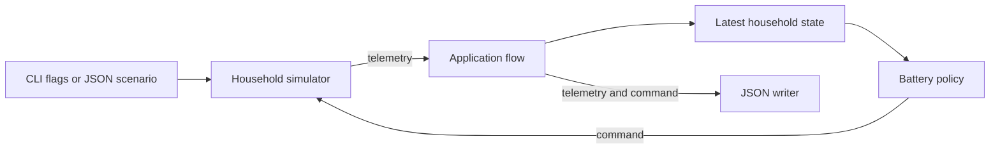

# Architecture

## System context

Wattfeder is one command-line application. It generates household telemetry and
chooses battery commands. It does not connect to an external energy device or
service.

## Components

| Component | Responsibility | Main input | Main output | Important dependency |
| --- | --- | --- | --- | --- |
| Command-line entry point | Parse flags or load a demo scenario. Start one run. | Process arguments | Simulator configuration | Go flag parser or demo loader |
| Demo loader | Parse fixed JSON values and expected decisions. | Scenario file | Validated demo scenario | Simulator configuration rules |
| Household simulator | Own the clock, generated profiles, and battery state. | Configuration and battery command | Telemetry event | Seeded random number generator |
| Application flow | Move each event through state, policy, command application, and output. | Simulator telemetry | Combined telemetry and decision record | Simulator and household packages |
| Latest household state | Validate telemetry and retain the latest accepted values. | Telemetry event | Current household values | Telemetry validation |
| Battery policy | Choose charge, discharge, or idle. | Current household values | Battery command and reason | Battery capacity and interval |
| JSON writer | Write records to the terminal. | Telemetry and decisions | Newline-delimited JSON | Standard output |

## Data flow

1. The entry point builds a simulator configuration from flags or a scenario.
2. The simulator emits telemetry for the current timestamp.
3. The application validates the event through the latest-state component.
4. The policy reads the state and returns one command.
5. The simulator applies that command over the interval.
6. The application writes the telemetry and decision.
7. The next event reports the updated battery state.

The default command writes one combined JSON record per interval. The demo
writes separate progress records so each step is visible.

## Storage

There is no persistent storage. The simulator clock, battery state, and latest
telemetry remain in memory. JSON output goes to standard output. Process exit
removes all state.

## Configuration

The default application uses command-line flags. Run
`go run ./cmd/wattfeder -help` to list them. The demo reads
`scenarios/demo.json`. Unknown scenario fields and invalid values cause an error.

The simulator always runs for 24 hours. Its interval must divide that duration
exactly. The seed controls repeatable daily variation. No environment variables
are required.

## Failure handling

Configuration and telemetry are validated before use. Invalid telemetry does
not replace the latest state. An invalid command does not advance the simulator.
Output failures stop the run and return an error.

The application checks cancellation before each interval. SIGINT and SIGTERM
cancel the command without reporting an execution failure.

## Current limitations

- One process handles one household.
- There is no database, queue, network API, or external telemetry source.
- The state component accepts one device ID per run.
- There are no retries because the current flow has no external operations.
- Health endpoints and runtime metrics are not implemented.
- Planned components are listed in the [roadmap](roadmap.md), not in the current
  architecture diagram.
